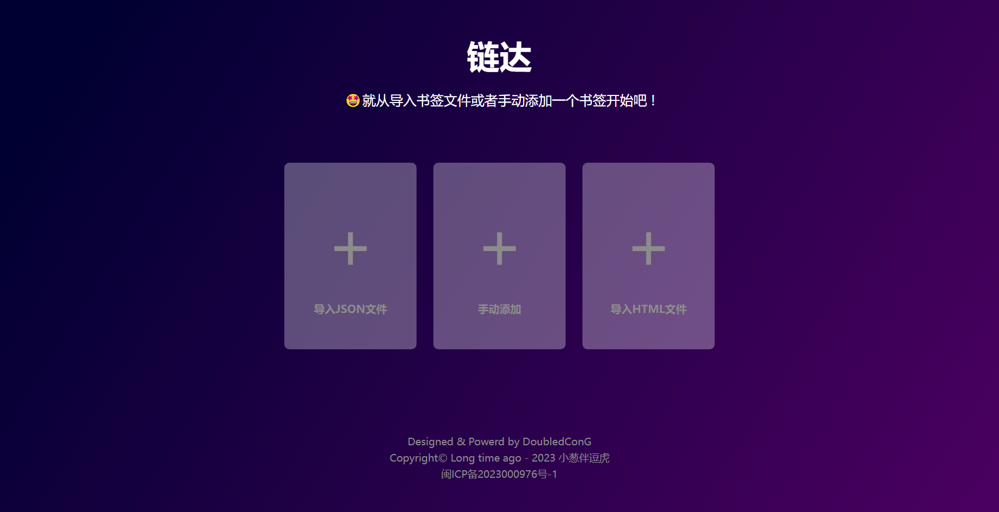
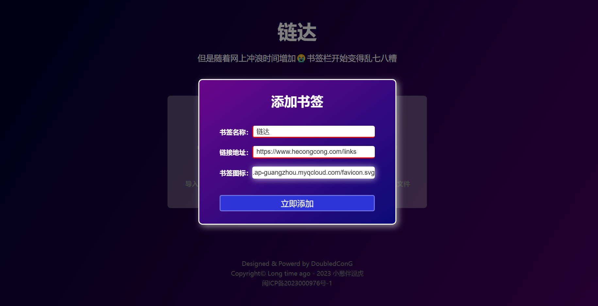
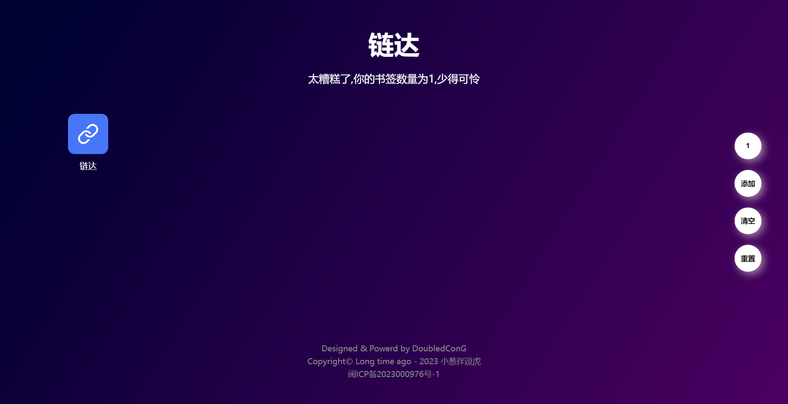
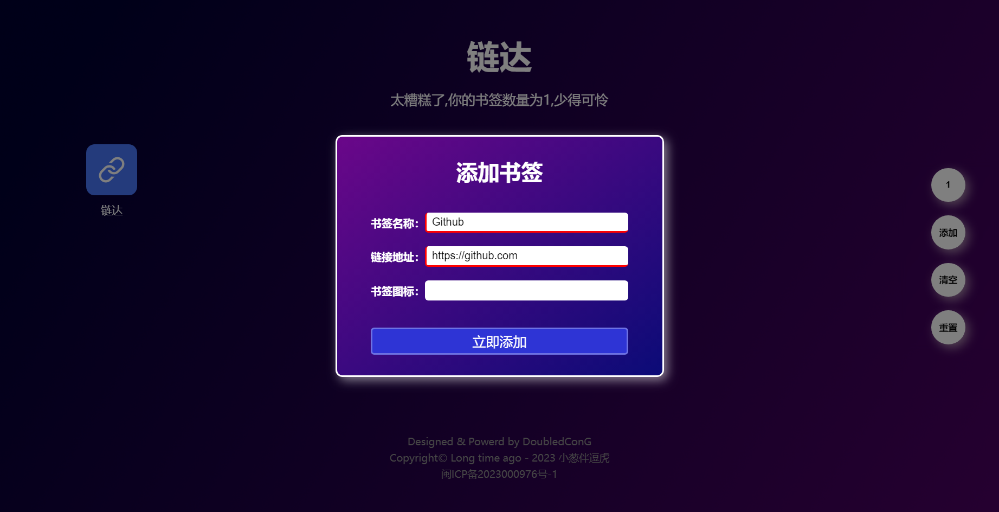
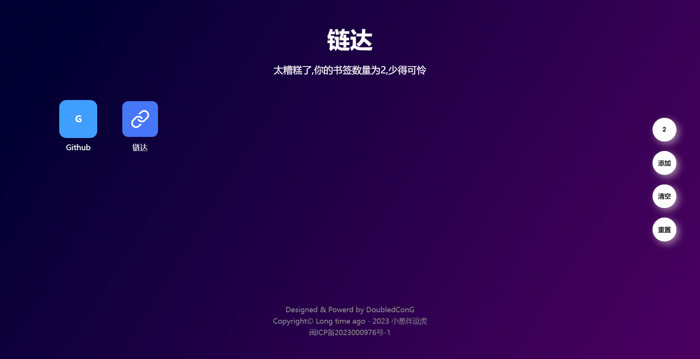
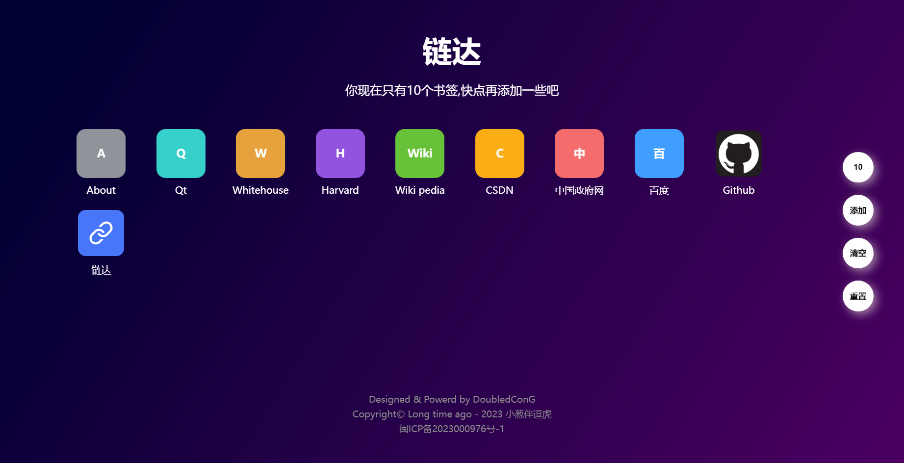
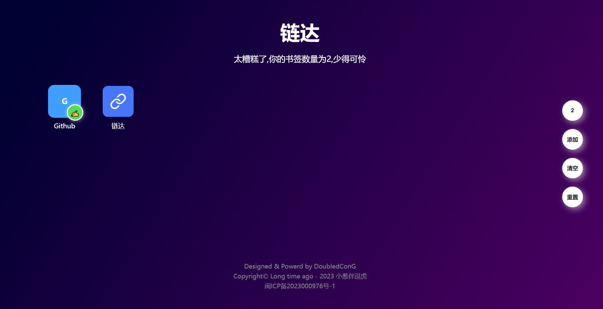
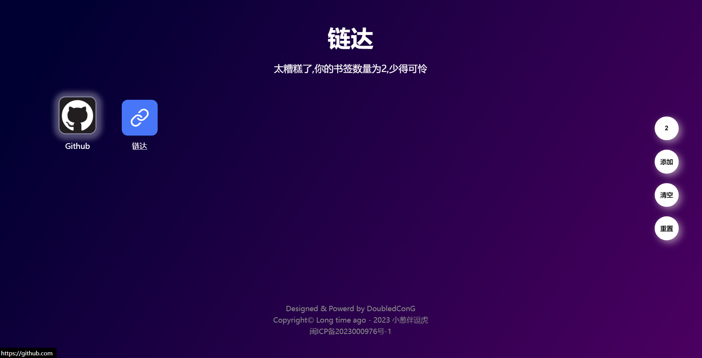
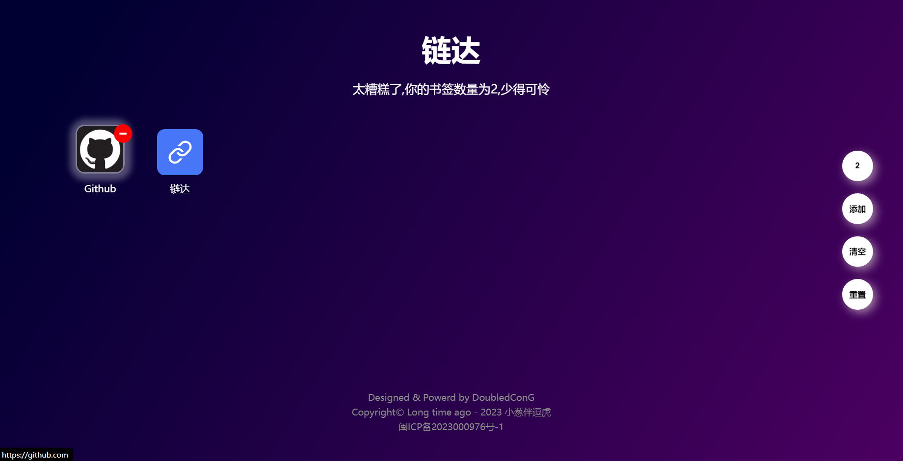

# Links-Dashing

It helps you manage your favorite browser bookmarks. I named it **“链达”**。

## First impression


## Usage

1. Import a JSON file whose contents are an array of objects, each representing a bookmark.
> This object is required to contain at least two fields, `name` and `url`, representing the bookmark name and bookmark address, respectively.

2. Import the HTML bookmark file exported from Google Chrome.

- **First step:** Export bookmarks from the Bookmark Manager in Google Chrome.

- **The second step:** Import it into the **[Links-Dashing](https://www.hecongcong.com/links/)**, and then use them.

3. Add bookmarks manually.



- As you can see, you can also add a bookmark icon, and I want you to fill this field with a web image address. The image to be used as the icon should preferably be square.
- Click the button 'Add Now' and you can see that it has been added successfully, then you'll see something like the picture below...



## Feature

1. **ADD**

Once on this page, you can add bookmarks by clicking on the button on the right.

For example, I now want to add GitHub to **[Links-Dashing](https://www.hecongcong.com/links/)**, You can do it like I did...



Oops, I guess you noticed I didn't add the icon address.

Don't worry, if you don't add an icon address, it will automatically generate a text icon.



Looks good, right? And there are different colors for different top-level domains.




```js
const colorStrategies = {
    com: '#409EFF',  // 亮蓝色
    cn: '#F56C6C',   // 亮红色
    net: '#faad14',  // 亮橙色
    org: '#67C23A',  // 亮绿色
    edu: '#9254de',  // 亮紫色
    gov: '#E6A23C',  // 亮黄色
    io: '#36cfc9',   // 亮青色
    default: '#909399' // 亮灰色
}
```

What? You still want to use images as icon. Fine !

2. **UPDATE**

Right-click on the icon to edit the bookmark.





3. **DELETE**

Press and hold on the icon for about three seconds to see the delete mark.



Now release the mouse to delete the bookmark, If you don't want to delete it, just move the mouse away from the icon and release it.


## Write at the end

Maybe my introduction is not enough to entice you to use it, but I am still actively updating it.I hope one day you will love this tool.If you have any comments or suggestions during use, please let me know through [issues](https://github.com/cccoding365/links-dashing/issues).

If you are interested in this project, you can give me a star or buy me a cup of coffee. Thank you very much!

 | 
-- | --
